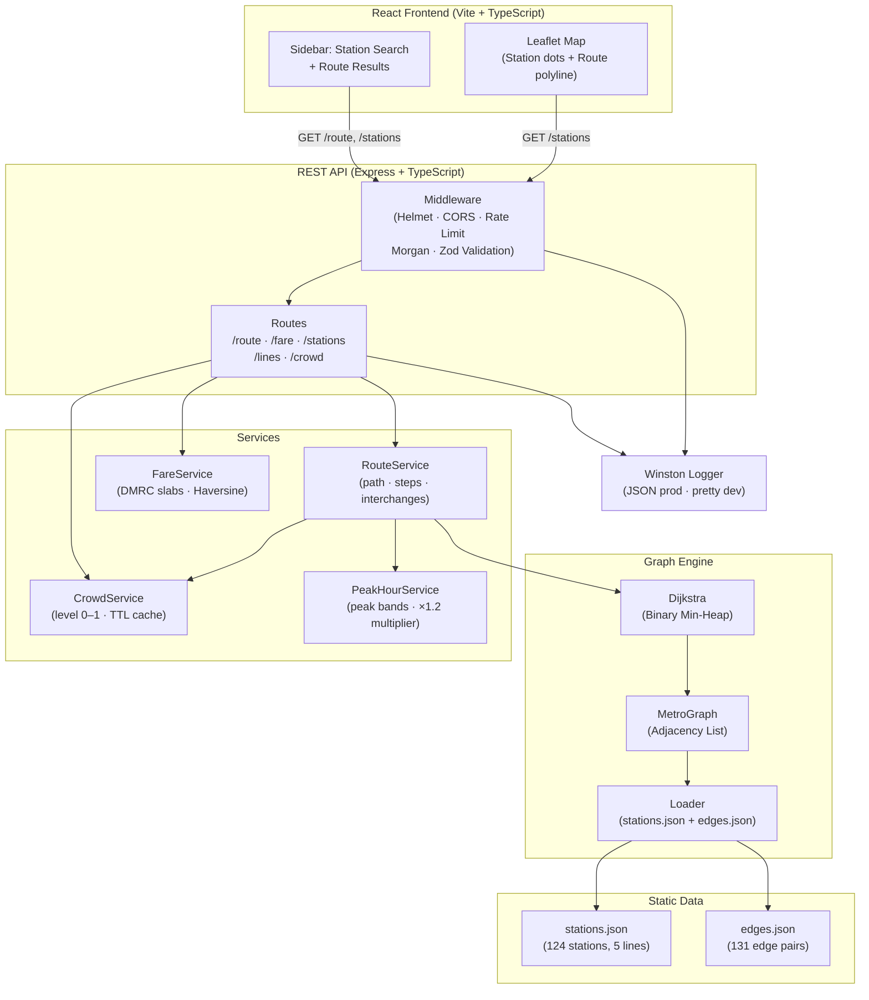

# 🚇 Metro Route Finder

A production-grade Delhi Metro routing service — refactored from a legacy Turbo-C program into a modern, graph-based REST API with a React frontend.

[](https://github.com/chawlashubham/Metro-Route-Finder/actions/workflows/ci.yml)

---

## Architecture



---

## Features

| Feature | Details |
|---------|---------|
| **Shortest route** | Dijkstra with binary min-heap on a weighted graph |
| **Interchange handling** | Transfer nodes with configurable penalty (default 5 min) |
| **Fare estimation** | DMRC slab model (₹10–₹60 by distance) |
| **Crowd-aware routing** | Per-station crowd level adjusts edge weights (`w × (1 + α × crowd)`) |
| **Peak-hour optimization** | 08:00–10:00 & 17:30–20:00 weekdays → 20% edge weight increase |
| **REST API** | 7 endpoints with Zod validation, rate limiting, structured error responses |
| **React frontend** | Interactive Leaflet map with colored metro lines + autocomplete search |
| **Docker** | Multi-stage build → minimal production image with non-root user |

---

## Metro Lines

| Line | Terminals | Stations |
|------|-----------|----------|
| 🔴 Red | Rithala ↔ Dilshad Garden | 21 |
| 🟡 Yellow | Jahangirpuri ↔ Huda City Centre | 34 |
| 🔵 Blue | Dwarka Sector 21 ↔ Vaishali | 34 |
| 🟢 Green | Mundka ↔ Inderlok | 16 |
| 🟣 Violet | Mandi House ↔ Badarpur | 19 |

**Interchanges:** Rajiv Chowk · Kashmere Gate · Central Secretariat · Inderlok · Kirti Nagar · Mandi House

---

## Quick Start

### Prerequisites
- Node.js 20+
- npm 9+

### Backend

```bash
# Install dependencies
npm install

# Copy environment config
cp .env.example .env

# Development (hot-reload)
npm run dev

# Production build
npm run build && npm start
```

The API will be available at `http://localhost:3000`.

### Frontend

```bash
cd frontend
npm install
cp .env.example .env     # set VITE_API_URL if needed
npm run dev              # dev server at http://localhost:5173
npm run build            # production build → dist/
```

### Docker

```bash
# Build and start the API
docker-compose up --build

# Or build the image manually
docker build -t metro-route-finder .
docker run -p 3000:3000 metro-route-finder
```

---

## API Reference

Base URL: `http://localhost:3000/api/v1`

### GET `/health`
Health check.
```json
{ "status": "ok", "timestamp": "2024-01-01T00:00:00.000Z" }
```

### GET `/api/v1/stations`
List all stations.
```
GET /api/v1/stations
```
```json
{ "data": [{ "id": "red-rithala", "name": "Rithala", "line": "Red", "lat": 28.726, "lng": 77.1079, "interchange": false }] }
```

### GET `/api/v1/stations/:id`
Get a single station by ID.

### GET `/api/v1/lines`
List all metro line names.

### GET `/api/v1/route`
Find the shortest route between two stations.

| Parameter | Type | Required | Description |
|-----------|------|----------|-------------|
| `from` | string | ✅ | Source station ID |
| `to` | string | ✅ | Destination station ID |
| `optimize` | `time` \| `distance` | ❌ | Default: `time` |
| `datetime` | ISO 8601 | ❌ | Datetime for peak-hour check (default: now) |

```
GET /api/v1/route?from=red-rithala&to=yellow-huda-city-centre
```
```json
{
  "data": {
    "from": "Rithala",
    "to": "Huda City Centre",
    "path": [
      { "stationId": "red-rithala", "stationName": "Rithala", "line": "Red", "action": "board" },
      "...",
      { "stationId": "yellow-kashmere-gate", "stationName": "Kashmere Gate", "line": "Yellow", "action": "transfer" },
      "...",
      { "stationId": "yellow-huda-city-centre", "stationName": "Huda City Centre", "line": "Yellow", "action": "alight" }
    ],
    "duration_seconds": 5430,
    "distance_km": 47.21,
    "fare": 60,
    "interchanges": [{ "station": "Kashmere Gate", "from_line": "Red", "to_line": "Yellow" }],
    "peak_hour": false,
    "warnings": []
  }
}
```

### GET `/api/v1/fare`
Estimate fare between two stations.

| Parameter | Type | Required |
|-----------|------|----------|
| `from` | string | ✅ |
| `to` | string | ✅ |

### GET `/api/v1/crowd`
Get crowd level at a station.

| Parameter | Type | Required |
|-----------|------|----------|
| `stationId` | string | ✅ |

### POST `/api/v1/crowd`
Report crowd level at a station.

```json
{ "stationId": "yellow-rajiv-chowk", "level": 0.9 }
```

### Error responses

All errors return:
```json
{ "error": { "code": "VALIDATION_ERROR", "message": "from: Required" } }
```

| Code | HTTP Status |
|------|------------|
| `VALIDATION_ERROR` | 400 |
| `NOT_FOUND` | 404 |
| `RATE_LIMIT` | 429 |
| `INTERNAL_ERROR` | 500 |

---

## Running Tests

```bash
# Run all tests
npm test

# With coverage report
npm run test:coverage

# Lint
npm run lint
```

Tests cover:
- **Unit:** Graph operations, Dijkstra algorithm, fare slabs, haversine distance
- **Integration:** All REST endpoints via Supertest

---

## Environment Variables

| Variable | Default | Description |
|----------|---------|-------------|
| `PORT` | `3000` | HTTP port |
| `NODE_ENV` | `development` | `development` or `production` |
| `CROWD_ALPHA` | `0.3` | Crowd weight factor (0–1) |
| `PEAK_HOURS` | `08:00-10:00,17:30-20:00` | Peak hour bands (comma-separated) |
| `TRANSFER_PENALTY` | `300` | Interchange transfer time (seconds) |
| `LOG_LEVEL` | `info` | Winston log level |

---

## Data Sources

Station coordinates and network topology are based on the **Delhi Metro Rail Corporation (DMRC)** network:
- Stations and line data derived from [DMRC official route map](https://www.delhimetrorail.com/metro-fares.aspx)
- For production, import live GTFS feeds from [data.gov.in](https://data.gov.in) using `scripts/importGtfs.ts`

---

## Deployment

### Cloud (Recommended)

**Railway.app / Render.com** (zero-infra):
```bash
# 1. Push to GitHub
# 2. Connect repo in Railway/Render
# 3. Set environment variables in dashboard
# 4. Auto-deploy on push
```

**Google Cloud Run:**
```bash
gcloud builds submit --tag gcr.io/PROJECT_ID/metro-route-finder
gcloud run deploy metro-api --image gcr.io/PROJECT_ID/metro-route-finder --platform managed
```

**AWS Fargate / ECS:**
```bash
docker tag metro-route-finder:latest AWS_ACCOUNT_ID.dkr.ecr.REGION.amazonaws.com/metro-route-finder
docker push AWS_ACCOUNT_ID.dkr.ecr.REGION.amazonaws.com/metro-route-finder
# Deploy via ECS console or terraform
```

### CI/CD Pipeline

On every push to `main`:
1. **Lint** TypeScript code
2. **Build** backend + frontend
3. **Run** unit & integration tests (with coverage upload)
4. **Build** Docker image
5. **Smoke test** container health endpoint

---

## Project Structure

```
Metro-Route-Finder/
├── src/
│   ├── graph/
│   │   ├── graph.ts          # MetroGraph (adjacency list)
│   │   ├── dijkstra.ts       # Dijkstra with binary min-heap
│   │   └── loader.ts         # Build graph from JSON data
│   ├── data/
│   │   ├── stations.json     # 124 stations across 5 lines
│   │   └── edges.json        # 131 bidirectional edge pairs
│   ├── services/
│   │   ├── routeService.ts   # Shortest path + step construction
│   │   ├── fareService.ts    # DMRC fare slabs + haversine
│   │   ├── crowdService.ts   # Crowd levels (in-memory + simulated)
│   │   └── peakHourService.ts# Peak hour detection + multiplier
│   ├── api/
│   │   ├── routes.ts         # Express router (7 endpoints)
│   │   └── middleware.ts     # Helmet, CORS, rate limit, error handler
│   ├── models/
│   │   └── types.ts          # TypeScript interfaces
│   ├── utils/
│   │   └── logger.ts         # Winston logger
│   └── server.ts             # App entry point
├── tests/
│   ├── graph.test.ts         # Graph + Dijkstra unit tests
│   ├── fare.test.ts          # Fare slab + haversine tests
│   └── route.test.ts         # API integration tests (Supertest)
├── frontend/
│   ├── src/
│   │   ├── components/
│   │   │   ├── StationSearch.tsx  # Autocomplete station search
│   │   │   ├── RoutePanel.tsx     # Route result sidebar
│   │   │   └── MetroMap.tsx       # Leaflet map
│   │   ├── App.tsx
│   │   ├── api.ts
│   │   ├── types.ts
│   │   └── constants.ts
│   └── package.json
├── .github/
│   └── workflows/ci.yml      # GitHub Actions: lint → test → build → docker
├── Dockerfile                # Multi-stage build (builder + runner)
├── docker-compose.yml        # API service
├── METRO1.C                  # Original Turbo-C source (preserved)
└── README.md
```

---

## Legacy

The original `METRO1.C` (Turbo C / DOS) used:
- BGI graphics for display
- Doubly-linked lists for station connections
- Sequential traversal (no shortest-path algorithm)
- Hard-coded interchange logic for 3 nodes
- Ad-hoc fare formula

This project is a complete ground-up rewrite preserving the same Delhi Metro domain.

---

## License

MIT
